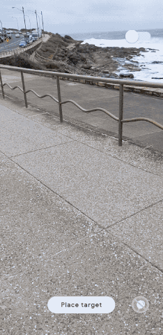
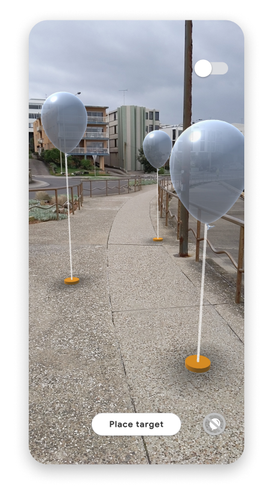
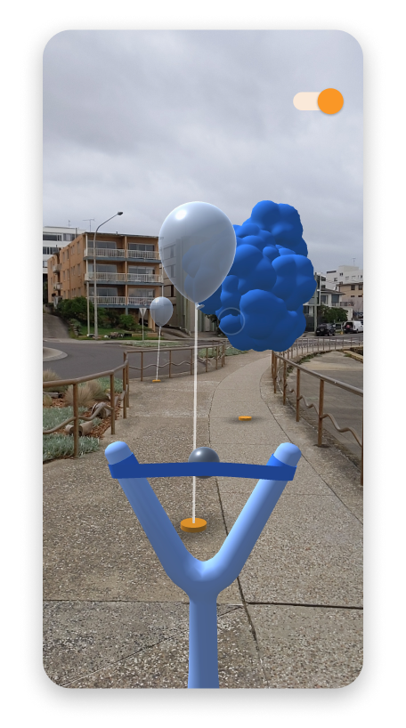
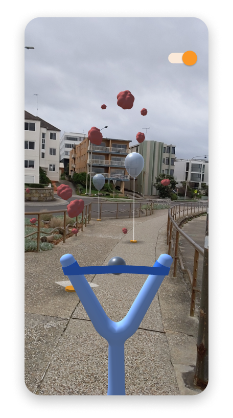
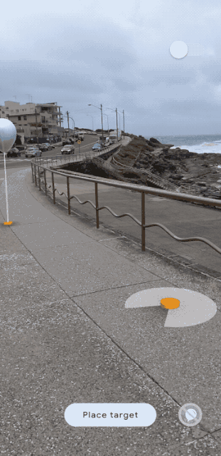
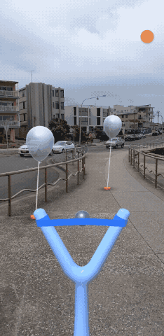
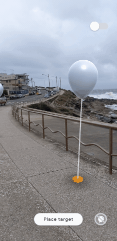
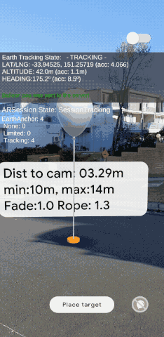
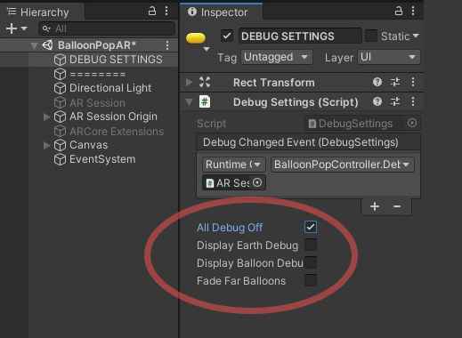

# Balloon Pop
## A multiplayer geospatial experience
 

By Google Creative Lab, Sydney  
 
<b>Contents:</b>

- [What is the Balloon Pop code example?](#intro)
- [How does it work?](#how)
- [Requirements](#requirements)
- [Developer Setup](#setup)
- [Debug](#debug-notes)
- [Attributions](#attributions)
- [Contributors](#contributors)

 

 

------------
 

## What is the Balloon Pop code example?

Balloon Pop is a simple sandbox style game that showcases a multiplayer experience using the ARCore Geospatial API and [Firebase](https://firebase.google.com).

Place geospatial anchors in the world, and they will stay fixed to the ground in AR. In this demo, balloons are placed as targets and hit using a ball that reacts to distance in world space. The multiplayer aspect means that nearby users can pop the same balloons using Firebase.
 
 

    
    
    

 

------------
 

## How does it work?

The Balloon Pop Unity project can be built to create a mobile game/app. The project uses Unity 2019.4.36f1 and [Google's ARCore Geospatial API](https://developers.google.com/ar/develop/geospatial/).

The Geospatial API anchors balloons to specific GPS coordinates in the real world. The API can track a user's latitude, longitude and altitude on the earth. A user can place a balloon at a location N meters directly ahead of them, at their current altitude (using data from the ARCore Geospatial API). 

The balloon anchor's latitude, longitude and altitude is stored on a Firestore database in the cloud. A multiplayer experience is created by loading balloons nearby and anchoring them at the same position in the real world. Users can pop balloons and even watch balloon pops triggered by other players.

 

    
    
    

 

------------
 

## Requirements

Your app will require the following:
- Internet and GPS access.
- The experience works best outdoors.
- A compatible device: Android: Google Pixel 2 or later device for optimum performance.

 

------------
 

## Developer Setup

The app has not been released to the public on a mobile app store, but the code can be downloaded and built in Unity. So far the experience has only been tested on fairly recent Android phones, such as a Pixel or Samsung Galaxy 7 or higher.

- [Unity App](#setup-unity)
- [ARCore Geospatial API Key](#setup-geo-ar)
- [Firestore Balloon Database (optional)](#setup-firestore)

 

### Unity App

1. Download Unity version [2019.4.36f1](https://unity3d.com/unity/qa/lts-releases?version=2019.4) for compatibility. We recommend using Unity Hub.

2. Clone this repo to your machine (optionally fork this repository if you plan on expanding on it).

3. Open the project in Unity 2019.4.36f1, and open the 'BalloonPopAR' scene (if it doesn't open automatically).

4. Follow the steps below in the ['ARCore Geospatial API Key'](#setup-geo-ar) section

5. Follow the steps below in the ['Firestore Balloon Database'](#setup-firestore) section

6. Deploy to an [ARCore compatible device](https://developers.google.com/ar/discover/supported-devices).

 

### ARCore Geospatial API Key

You will need an API Key with ARCore Geospatial API enabled for your app to use GeoAR features.

Follow the steps [here to in order to obtain an API key.](https://developers.google.com/ar/develop/geospatial/unity-arf/developer-guide)

Add the API Key to your Unity Project:
1. Open the Unity Project Settings

2. Under 'XR Plug-in Management', click on 'ARCore Extensions'

3. Past the Android API Key into the 'Android API Key' textfield

4. 'Geospatial' should be turned on

 

### Firestore Balloon Database

The project uses the Firestore database in Firebase to save balloon coordinates, send balloon pops and listen for changes in balloons near the user. This allows the game to keep a shared global state of balloon locations, creating a multiplayer experience of balloon placing and popping.

#### Install Firebase

Import the following plugins - using `Assets > Import Package > Custom Package` menu item - from the [Firebase Unity SDK](https://firebase.google.com/docs/unity/setup):

##### IMPORTANT
After importing the Firebase packages you may run into a compatibility issues with the ExternalDependencyManager (EDM) that ships with both Firebase and and ARCore Extensions. We recommend using whichever version is newer. 

If ARCore Extensions has a newer EDM you may uncheck the 'ExternalDependencyManager" when  importing these packages:

* FirebaseAuth.unitypackage
* FirebaseFirestore.unitypackage

If Firebase is using a newer EDM we suggest installing the lite version of ARCore Extensions per the instructions [here](https://developers.google.com/ar/develop/unity-arf/getting-started-extensions#without-edm4u). 

#### Create a Firebase API Key

1. Create a [Firebase account if you don't already have one](https://firebase.google.com/docs/firestore/quickstart#create)

2. Add a new project in the [Firebase Console](https://console.firebase.google.com/).

3. In the 'Build' -> 'Firestore Database' section of your project click ['Create a database'.](https://console.firebase.google.com/project/webgl-exploration/firestore)

4. Select production mode and choose a relevant region for your Cloud Firestore data to be stored.

5. Create a new collection in your database and name it 'balloons'.

6. Go to your 'Project settings' -> 'General' -> 'Your apps' and click the 'Add app' button. Click the button with the Unity icon on it.

7. Choose a unique package name (for Android), then download the 'google-services.json' config file for the Android build.

8. Now place the 'google-services.json' config file in the 'StreamingAssets' folder within the Unity project. (Assets -> StreamingAssets -> 'google-services.json').

 

------------
 

## Debug
 

Within the 'BalloonPopAR' Unity scene, there is a GameObject called "DEBUG SETTINGS". You can use this to toggle some debug info about the Geospatial API by toggling 'Display Earth Debug'. You can also toggle a information panel to be shown on every balloon which displays some useful information about each balloon.

 

    
    

 

------------
 

## Attributions
 

### Balloon Pop Cloud Asset

[Cloud 3D model 'Cloudsculpt2' on Sketchfab](https://sketchfab.com/3d-models/cloudsculpt2-2c6409c6f3db4c4a8fea3c6f1ef3d334) 
The 3D model was slightly modified. 
Author: [curiositysphere](https://sketchfab.com/curiositysphere) 
License: [CC BY 4.0](https://creativecommons.org/licenses/by/4.0/) 
(Creative Commons)

 

------------

## Contributors

 - [Jude Osborn](https://github.com/JudeOsborn)
 - [Marcio Puga](https://github.com/MarcioPuga)
 - [Nick Cellini](https://ncellini.com) | [Github](https://github.com/cellininicholas) | [Twitter](https://twitter.com/nfcellini)

## License & Notes
[Apache 2.0 license.](https://www.apache.org/licenses/LICENSE-2.0)

This is not an official Google product, but an AR Experiment developed at the Google Creative Lab. We’ll do our best to support and maintain this experiment but your mileage may vary.

We encourage open sourcing projects as a way of learning from each other. Please respect our and other creators’ rights, including copyright and trademark rights when present, when sharing these works and creating derivative work.

You must disclose the use of ARCore’s Cloud Anchors or Geospatial APIs prominently in your application by including the following text, as well as a link to learn more on a notice screen: https://developers.google.com/ar/cloud-anchors-privacy.

To power this session, Google will process visual data from your camera. [Learn more](https://developers.google.com/ar/cloud-anchors-privacy).

You can do this by implementing the recommended user notice flow available in our [Cloud Anchor sample apps](https://developers.google.com/ar/develop/downloads) and Geospatial API sample apps.

 
